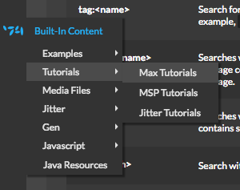

# Max/MSP Knowledge

Hier ein paar nützliche Links und Tipps zum Thema **Max/MSP**

## Überblick

Max ist eine visuelle Programmiersprache und Laufzeitumgebung für Multimediaanwendungen, die sich
[hier](https://cycling74.com/downloads)
herunterladen lässt.

In der [Ausleihe](https://shoptechnikfbmd.iqrent.de/search/?keyword=MAX7) lassen sich Lizenzen für Max 7 ausleihen.

Wer keine Lust hat auf die Ausleihe angewiesen zu sein, kann [hier](https://cycling74.com/shop) eine eigene Lizenz erwerben. Nach einer Registrierung auf der Seite von Cycling'74 kann man sich dort als Student*in verifiziern lassen und hat dann Anspruch auf eine vergünstige *Academic Licence*.

## Einstieg

### Documentation in Max finden

Fast alle Tutorials in diesem Abschnitt finden sich auch direkt innerhalb von Max.
Um dorthin zu kommen sind folgende Schritte notwending:

```
File -> Filebrowser (oder CMD+B auf MacOS bzw)

In der linken Seitenleiste -> Cycling'74 Content (siehe Bild)

```

 <!--- { width=250px } -->

### Object Help

Abseits davon lohnt es sich immer, mal einen Blick auf die Helppage von einzelnen Max-Objekten zu werfen. Dazu reicht ein Rechtsklick auf das Objekt gefolgt von einem gezielten Linksklick auf `show [OBJ] help`.

## Online Documentation

Alles was wirklich über Max wissen muss findet sich in der Max Documentation:

[Max Documentation](https://docs.cycling74.com/max7/)

Die Grundlagen von Max (Objects, Syntax, Messages, Datatypes). Es lohnt sich hier anzufangen um die Grundlagen zu verstehen:

[Basic Max Tutorials](https://docs.cycling74.com/max7/tutorials/00_maxindex)

Je nach Kenntnisstand von Themen rund um das Thema DSP und Digital Audio empfiehlt sich die folgende Einführung in das Thema:

[How Digital Audio Works](https://docs.cycling74.com/max7/tutorials/02_mspdigitalaudio)

Danach ist es Zeit sich endlich in die Welt von Signalen, Oszillatoren und Filtern zu stürzen:

[Max MSP (Max Signal Processing) Tutorials](https://docs.cycling74.com/max7/tutorials/00_mspindex)

Und wem das an dieser Stelle noch nicht reicht, der kann sich mit **Gen** beschäftigen:

[Max gen Tutorials](https://docs.cycling74.com/max7/vignettes/gen_topic)

Wer es bis hier geschafft hat ist inzwichen Max-Experte und bereit für die Reference! Hier finden sich ausführliche Informationen über jedes einzelne Objekt und jede einzelne Methode und Message im ganzen Max-Universum:

[Max Object Reference](https://docs.cycling74.com/max7/vignettes/docrefpages)

## Fortgeschrittenes

### Videos, Tutorials, etc.
[Delicious Max Tutorials](https://www.youtube.com/playlist?list=PLD45EDA6F67827497) ist eine sehr empfehlenswerte Tutorial-Serie von *Sam Tarakajian* einem der Entwickler von Max bei Cycling'74.

[Max Community Tutorials](https://cycling74.com/tutorials/page/1)
